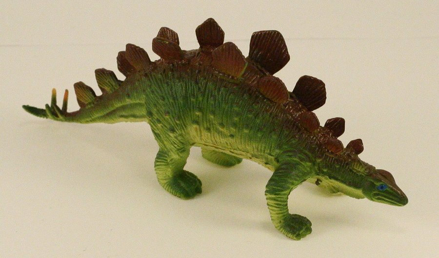

# 60 - Stegosaurus

*Written by Emily Leng*

## Problem

Try your hand at some [stego](http://en.wikipedia.org/wiki/Steganography).



## Hint

Open up the problem in a hex editor and take a look around.

## Solution

Open stegosaurus.jpg in hexdump in the Linux terminal.

`$ hd stegosaurus.jpg`

At the bottom, you will see:
```
000144e0  54 48 49 53 20 57 41 53  20 45 41 53 59 20 00 00  |THIS WAS EASY ..|
000144f0  4e 45 58 54 20 54 49 4d  45 20 57 49 4c 4c 00 00  |NEXT TIME WILL..|
00014500  42 45 20 48 41 52 44 45  52 0d 0a ae 28 44 76 94  |BE HARDER...(Dv.|
00014510  46 4c 41 47 20 49 53 20  5c b0 c8 1b b9 35 2c 4c  |FLAG IS \....5,L|
00014520  68 33 78 5f 31 73 5f 63  30 30 6c 20 4f e0 3a 57  |h3x_1s_c00l O.:W|
```

## Flag

`h3x_1s_c00l`
