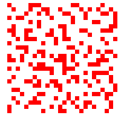
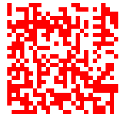

# 90 - Pixelated

*Written by Emily Leng*

## Problem

<table align="center" border="0" cellpadding="1" cellspacing="1" style="width:500px"><tbody><tr><td></td><td></td></tr></tbody></table>

## Hint

Did you know you can do [arithmetic with images](http://homepages.inf.ed.ac.uk/rbf/HIPR2/arthops.htm) too?

## Solution

By XORing the two images and turning the red pixels black, you can get a working QR!

## Flag

`pixelsmatterinQRs`
