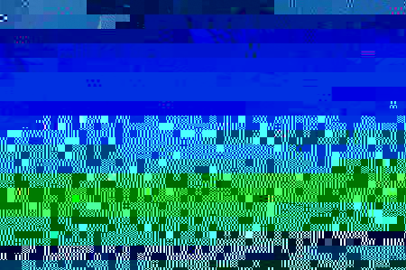

# 150 - Ghoti

## Problem

Haaaalppp I can't pronounce this word. What could this image mean?

## Hint

Look for clues in the file. The file appears corrupted, but maybe it still contains some important information.

## Solution

First, to solve this problem, we need to find clues (notice the s). There are 2 clues needed to solve the problem.

We can obtain both clues quite easily. The first one is to simply open the picture as a rar file.
Inside the rar file, we find a file called sh58, which, if we open with notepad, contains the ciphertext `1e95153b6c941098227a4b08d9d74cb9d7b9387f83c74097`.

To obtain the second clue, we must open the jpg with a hex editor (I used HxD). Then, Ctrl+F "flag", in which it says "here's a hint at the flag: tetraodontidae"

Given these two clues, we can now decrypt the ciphertext. A quick google of "tetraodontidae" reveals a type of encryption called "blowfish," which requires a key and ciphertext. Perfect!
After using many different websites, the one that worked for me was http://webnet77.com/cgi-bin/helpers/blowfish.pl

Enter "tetraodontidae" as the key and "1e95153b6c941098227a4b08d9d74cb9d7b9387f83c74097" as the ciphertext, and you get the flag!

## Flag

bl0w_fish_so_s3cret_
